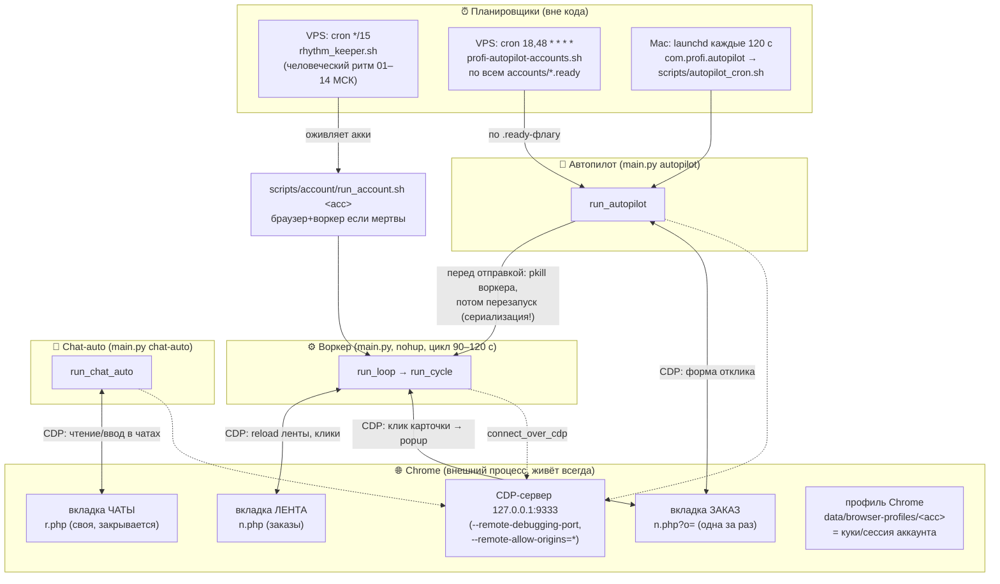
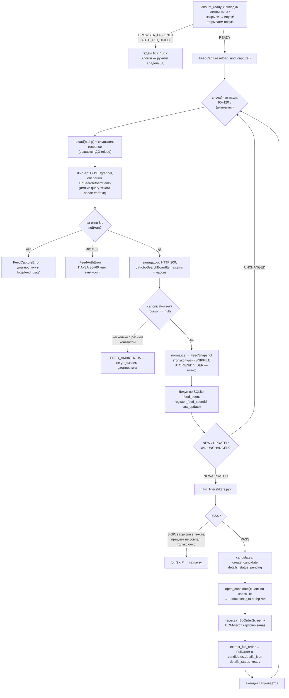
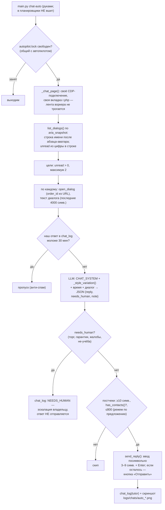
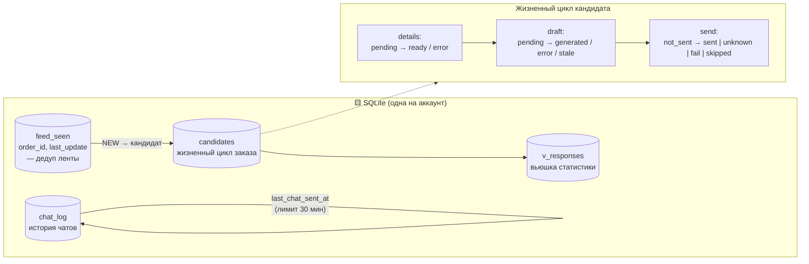
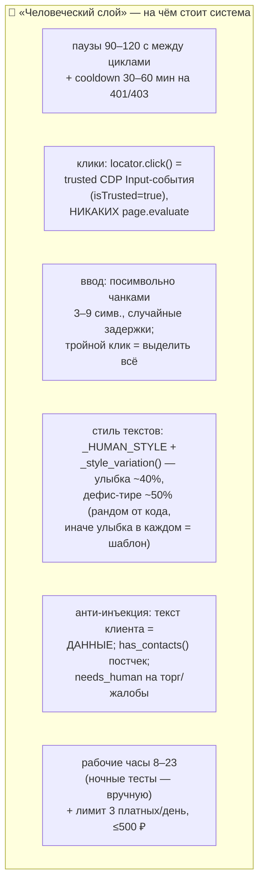
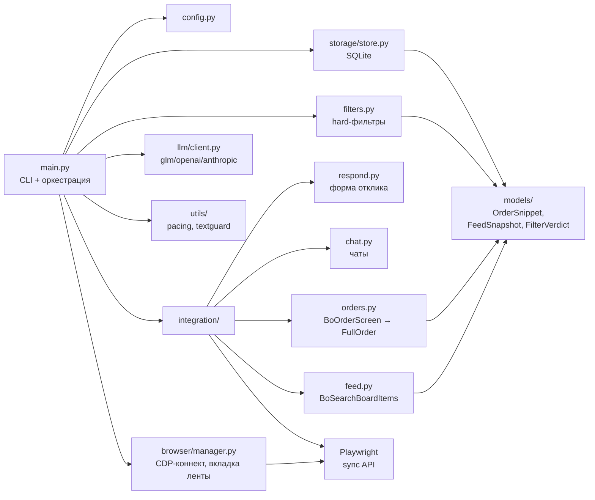

# ARCHITECTURE.md — полная Mermaid-диаграмма системы

Живой документ: обновлять вместе с кодом. Источник правды — код
(`src/profi/`) и `docs/SPEC.md`; эта схема — его наглядная проекция.

Легенда цветов (flowchart): 🟩 планировщики · 🟦 Chrome/CDP · 🟨 данные/БД ·
🟥 LLM · 🟪 платная отправка · ⬜ прочее. Все тайминги/лимиты — из
`src/profi/config.py`.

## 1. Общая картина: процессы и Chromium (CDP)

Один Chrome-профиль = один аккаунт = одна персона. Chrome живёт сам по себе
(в нём сессия Профи); все процессы подключаются к нему по CDP-порту.



## 2. Контур A — воркер ленты (каждые 90–120 с)

Пассивный перехват: данные читаются из сетевых ответов страницы, а не из DOM.



## 3. Контур A — автопилот (каждые 2 мин): триаж → платная отправка

```mermaid
flowchart TB
    B0["trigger: launchd/cron → main.py autopilot"] --> B1{"рабочие часы?<br/>config.WORK_HOURS<br/>(норма 8–23)"}
    B1 -->|нет| BX["молча выходим"]
    B1 -->|да| B2{"autopilot.lock<br/>свободен? (TTL 30 мин)"}
    B2 -->|занят| BX
    B2 -->|да| B3["кандидаты:<br/>details=ready AND send=not_sent<br/>AND draft=pending"]

    B3 --> B4["по каждому заказу — жёсткие гейты ДО LLM:"]
    B4 --> G1{"«ваканс» в details_json?<br/>(бейдж полной карточки,<br/>инцидент #92799459)"}
    G1 -->|да| SK["skipped + note"]
    G1 -->|нет| G2{"bid_price ><br/>MAX_RESPONSE_PRICE_RUB<br/>(500 ₽)?"}
    G2 -->|да| SK
    G2 -->|нет| G3{"competition_position<br/>> 20?"}
    G3 -->|да| SK
    G3 -->|нет| G4{"has_bid?<br/>(уже есть отклик)"}
    G4 -->|да| SK
    G4 -->|нет| B5

    B5["user_prompt = _llm_order_payload(d)<br/>(компактный слепок 12 полей,<br/>без price_hash и raw-мусора)"] --> B6["+ _recipient_hint(d)<br/>(«КОМУ ПИШЕМ»: родитель/<br/>ученик/неясно)"]
    B6 --> B7["LLM: TRIAGE_SYSTEM + _style_variation()<br/>(GLM-5.3-Flash → GLM-5.3;<br/>модель видит персона + стиль + адресат)"]

    B7 --> B8{"verdict из JSON<br/>(llm.json_reply)"}
    B8 -->|"skip / JSON не спасся<br/>после цепочки попыток"| SK2["skipped / draft=error"]
    B8 -->|send| B9{"постчек текста:<br/>has_contacts()?<br/>(анти-инъекция: ссылки,<br/>телефоны, t.me)"}
    B9 -->|да| SK3["skipped: INJECTION_GUARD"]
    B9 -->|нет| B10{"длина 100–500 симв.<br/>(режем по границе предложения)"}
    B10 -->|нет| SK
    B10 -->|да| B11

    B11["_worker_running()?<br/>pkill profi.main<br/>(сериализация с монитором)"] --> B12["run_respond(order_id, RATE, text, send=True)"]
    linkStyle 33 stroke:#c00,stroke-width:2px

    subgraph RESP["run_respond — платная отправка"]
        direction TB
        R1["open_respond_form:<br/>гейт «Вам подходит?» → «Да»<br/>→ тарифы → «Продолжить»<br/>или CTA «Написать клиенту»"] --> R2["fill_form:<br/>ставка тройным кликом (clear!)<br/>+ input_value == rate? –– иначе RespondError<br/>текст посимвольно 3–9 симв., паузы<br/>человеческий рандом (RULES §1)"]
        R2 --> R3["read_footer: «К оплате» N ₽"]
        R3 --> R4{"гейты денег:<br/>to_pay ≤ 500 ₽?<br/>sends_today &lt; 3 ?<br/>(sent+unknown считаются,<br/>fail/skipped — нет)"}
        R4 -->|нет| RC["отмена: вкладка закрывается,<br/>деньги не тратятся"]
        R4 -->|да| R5["click_send() →<br/>ждём редирект r.php?id=<order>"]
        R5 --> R6{"исход"}
        R6 -->|"redirect на чат"| RS["send_status=sent ✓"]
        R6 -->|"«Произошла ошибка»<br/>на странице (rpc 400)"| RF["send_status=fail<br/>(инцидент #92799459:)<br/>деньги НЕ списаны"]
        R6 -->|"не поняли исход"| RU["send_status=unknown<br/>(списание могло пройти,<br/>лимит дня съеден — честно)"]
    end

    B12 --> RESP
    RESP --> B13["_start_worker()<br/>(nohup uv run python -m profi.main)"]
    B13 --> B14["stats в autopilot.log:<br/>note + модель + цена + позиция"]
```

## 4. Контур B light — автоответы в чатах (ручной запуск)



## 5. Данные и статусы (SQLite, data/&lt;acc&gt;.db)



## 6. Анти-детект и человечность (RULES.md)



## 7. Стилевая схема кода (src/profi/)



## 8. Известные инциденты, зашитые в код

| Дата | Инцидент | Защита теперь |
|---|---|---|
| 01.09 | GLM обрезал JSON по max_tokens | цепочка моделей с наращиванием токенов |
| 01.09 | PATH в launchd → exit 127 | экспорт PATH в autopilot_cron.sh |
| 02.09 23:00 | #92799459: бейдж «вакансия» не в сниппете + сайт подставил 2000 → «20002000», rpc 400 | гейт вакансии по details_json; тройной клик + сверка input_value; статус fail по маркеру ошибки |
| 02.09 | price_hash съедал лимит промпта | _llm_order_payload — компактный слепок |
| 02.09 | вопрос школьнику вместо родителя | _recipient_hint («КОМУ ПИШЕМ») |
